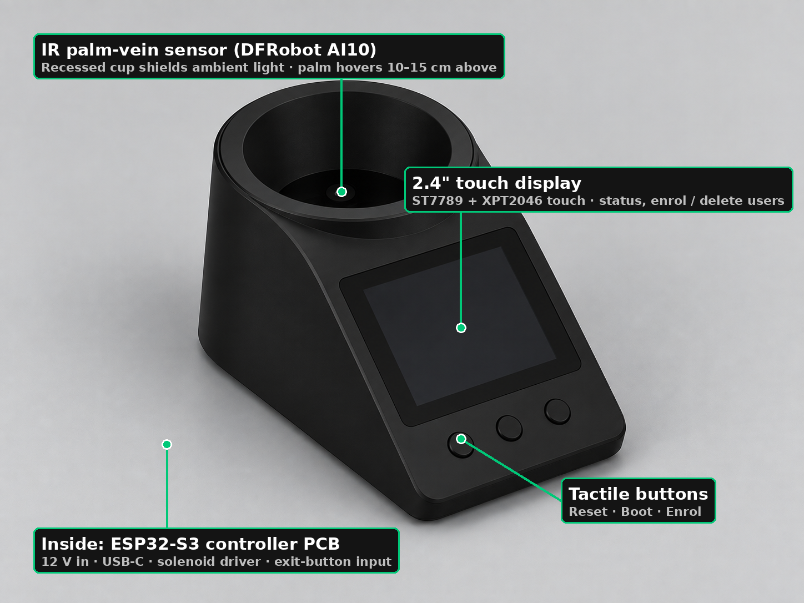
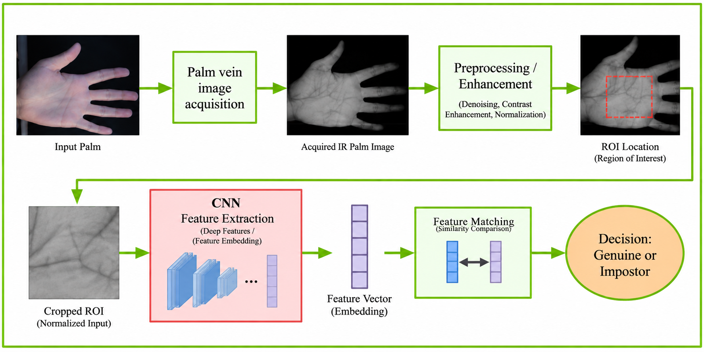
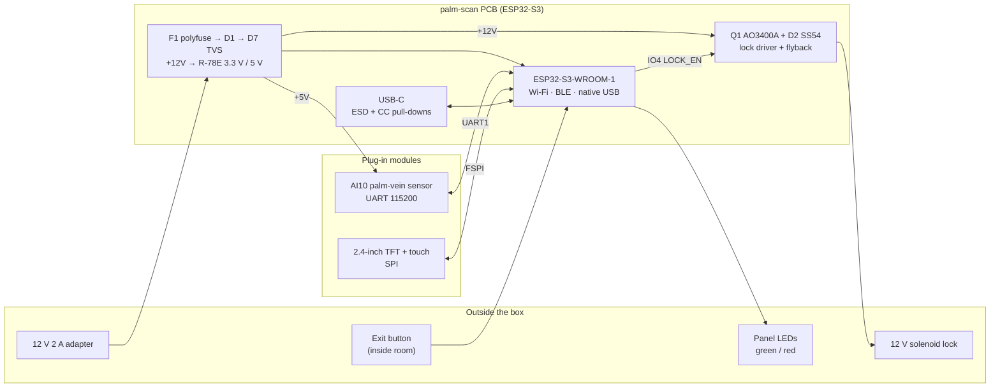

# palm-scan

**A palm-vein door lock.** Hold your hand over the sensor; if the veins under your skin match, the door unlocks.

<p align="center">
  
</p>

No cards, no PINs, no fingerprints. Veins are *inside* the body — a photo of your hand, a silicone copy, or a lifted print does nothing. And the pattern only shows up when blood is flowing, so the sensor gets liveness detection for free.

| | |
|---|---|
| **Status** | Schematic **Rev 2.4** — reviewed twice, ERC clean, netlist verified. **PCB layout is next.** |
| **Controller** | ESP32-S3-WROOM-1 (N8R2), custom 2-layer PCB, 46 parts |
| **Sensor** | DFRobot AI10 (SEN0677) binocular palm-vein / face module, UART |
| **UI** | 2.4" 240×320 TFT + resistive touch, 2 panel LEDs, piezo buzzer |
| **Actuator** | 12 V fail-secure solenoid lock, MOSFET-driven, inside exit button |
| **Power** | 12 V 2 A adapter → polyfuse → reverse diode → TVS → 3.3 V + 5 V switching regulators |
| **Roadmap** | Firmware (ESP-IDF) → PCB → bring-up → own CNN matcher trained on IR frames pulled from the sensor |

---

## How palm-vein recognition works

Blood carries haemoglobin. In the near-infrared window (**700–900 nm**) haemoglobin absorbs light much more strongly than the tissue around it. Shine NIR at a palm, and the veins show up as **dark shadows** on a camera that can see NIR — even though they're invisible to your eye. NIR penetrates only ~3.5 mm at 850 nm, which is exactly deep enough to reach the subcutaneous veins and no further.

<p align="center">
  
</p>

Every palm-vein system, from a ₹3,000 module to a Fujitsu PalmSecure, runs the same four stages:

| Stage | What happens | In palm-scan |
|---|---|---|
| **1. Acquisition** | NIR LEDs illuminate the palm from the *same side* as the camera (reflection method — transmission needs LEDs bright enough to shine *through* your hand). | AI10 module: NIR LED array + NIR-sensitive camera, 240×320 output. |
| **2. Preprocessing / ROI** | Denoise, normalise contrast, then cut out a fixed **Region of Interest** — usually a square anchored on the finger-web valleys so the same patch of palm is compared every time, regardless of hand position. | Done inside the AI10 today. Our own ROI extraction is part of the CNN phase. |
| **3. Feature extraction** | Turn the ROI into a compact signature. Classical: Gabor filters, LBP, line/curvature detectors. Modern: a **CNN embedding** — a vector of a few hundred numbers. | AI10 built-in matcher now → own CNN embedding later. |
| **4. Matching** | Compare the signature with the enrolled templates. Hamming / cosine distance below a threshold → *genuine*, else *impostor*. Tuned on **EER** (equal error rate — where false accepts = false rejects). | Threshold set inside the AI10; `VERIFY` returns user ID + score. |

Why veins beat fingerprints for a door lock — from Wu et al.'s 2019 review in *IET Biometrics*:

- **Uniqueness:** vein networks differ even between identical twins and between your own two hands.
- **Liveness:** no blood flow, no image. A severed or fake hand fails.
- **Robust:** dirt, cuts, wet or dry skin don't change what's *under* the skin.
- **Contactless:** nothing to touch, nothing to smudge.
- **Open problems** the paper flags — and that this project will run into: cheap acquisition hardware, ROI location without a hand guide, skin changes with age, and the fact that the best published deep-learning results are held back by tiny public datasets (CASIA ≈ 7,200 images, PolyU ≈ 6,000, VERA ≈ 2,200).

---

## System architecture



**Design decisions worth knowing** (full reasoning in [`docs/DESIGN_REVIEW.md`](docs/DESIGN_REVIEW.md)):

- **Lock is fed *after* the reverse-protection diode.** Rev 2.0 had it before — plugging the adapter in backwards would have shorted through the MOSFET's body diode. Caught in review.
- **Sensor runs on 5 V, not 12 V.** The AI10 accepts 5–12 V; at 12 V its internal regulator cooks. 5 V keeps it cool and makes the adapter's exact voltage irrelevant.
- **Display's SDO pin is left unconnected.** The ST7789 on these modules doesn't release MISO when deselected, so it fights the touch controller. Well-known trap; days lost by many.
- **Everything near the MCU is 3.3 V.** Display powered from +3V3, sensor UART assumed 3.3 V (measured before connection — see bring-up).
- **Fail-secure + watchdog.** Power cut = locked, so the door must have a mechanical handle inside (fire-safety rule, not a preference). Firmware caps any unlock at 5 s with a hardware task watchdog — the solenoid is intermittent-duty and will burn if held on.

### GPIO map

| GPIO | Net | Role |
|---|---|---|
| IO4 | `LOCK_EN` | Solenoid driver gate (via 100 Ω, 10 k pull-down) |
| IO5 | `BUZZER` | Passive piezo |
| IO6 | `EXIT_BTN` | Exit button, RC-debounced |
| IO7 | `USB_DET` | VBUS sense, 100k/150k divider |
| IO8–IO14 | SPI + `TOUCH_IRQ` `TOUCH_CS` `TFT_CS` `TFT_DC` | Display and touch on FSPI (IOMUX pins) |
| IO17 / IO18 | `SEN_RX` / `SEN_TX` | UART1 to AI10 |
| IO19 / IO20 | `USB_D-` / `USB_D+` | Native USB |
| IO21 | `TFT_RST` | Display reset |
| IO1 / IO2 | `LED_OK` / `LED_DENY` | Panel LEDs |
| IO43 / IO44 | `TXD0` / `RXD0` | Debug UART header |
| IO0 | `BOOT` | Strapping — button only |
| IO3, IO45, IO46 | — | Strapping — deliberately unconnected |

---

## Repository layout

```
palm-scan/
├── README.md
├── docs/
│   ├── COMPONENTS.md       BOM in three lists: fab-assembled / hand-soldered / off-board
│   ├── NETLIST.md          Plain-words net table — the source of truth the schematic is checked against
│   ├── POWER_BUDGET.md     Rail currents, derating, fuse/adapter analysis, trace widths
│   ├── DATASHEETS.md       Numbers extracted from every datasheet, with page refs
│   ├── DESIGN_REVIEW.md    Two review rounds (19 findings) and what changed because of each
│   ├── datasheets/         Source PDFs
│   └── images/
├── hardware/
│   └── kicad/              KiCad 9 project — 10 hierarchical sheets, generated from Python
│       ├── gen_schematic.py        Writes all .kicad_sch files from a parts/nets table
│       ├── check_netlist.py        Diffs KiCad's exported netlist against docs/NETLIST.md
│       ├── make_wiring_diagram.py  Off-board cable diagram (SVG/PDF)
│       ├── palm-scan.pdf           Schematic, all sheets
│       └── palm-scan-wiring.pdf    Cable diagram
├── firmware/               ESP-IDF application — not started
└── ml/                     CNN matcher — not started
```

**The schematic is code.** `gen_schematic.py` holds the parts and nets and emits the KiCad files; `check_netlist.py` then proves KiCad's own netlist export matches the human-readable `NETLIST.md` pin-for-pin (153/153). Change the table, rerun both, and the schematic, the docs and the verification stay in sync.

```bash
cd hardware/kicad
python3 gen_schematic.py                                   # regenerate sheets
kicad-cli sch erc  --output erc.txt        palm-scan.kicad_sch
kicad-cli sch export netlist --output palm-scan.net palm-scan.kicad_sch
kicad-cli sch export pdf --output palm-scan.pdf palm-scan.kicad_sch
python3 check_netlist.py                                   # must print "0 problems"
```

Requires KiCad ≥ 9.0 (`kicad-cli` on PATH) and Python 3.10+.

---

## Roadmap

| Phase | Deliverable | State |
|---|---|---|
| 1 | Schematic, BOM, power budget, two design reviews | ✅ Rev 2.4 |
| 2 | Firmware: AI10 UART driver, lock state machine + watchdog, TFT UI, enrol/verify flow | ⬜ |
| 3 | PCB layout, DRC, Gerbers, order (JLCPCB assembly for the 32 SMD parts) | ⬜ |
| 4 | Bring-up: rail checks, sensor level check, first unlock on a bench solenoid | ⬜ |
| 5 | Enclosure (the render above is the concept; CAD to follow) | ⬜ |
| 6 | **Own CNN matcher** — see below | ⬜ |

Firmware comes before PCB on purpose: the sensor and display can be driven from an ESP32-S3 devkit on a breadboard today, so the protocol and UI get debugged while the board is being made, not after.

### Phase 6 — a CNN of our own

The AI10 does its matching on-chip and we don't get to see how. That's fine for a door, but the point of this project is to learn how the matching actually works. The plan:

1. **Harvest images.** The AI10's protocol has `MID_SNAP&UPLOAD_IMAGE` (0x71): it captures and streams a 240×320 JPEG over UART in 1 KB packets. So the sensor doubles as an NIR camera for dataset collection — no extra hardware.
2. **Build a dataset.** Our own small one (multiple sessions, both hands, varied height and angle — the paper's warning about tiny datasets applies), plus a public set (CASIA-MS-Palmprint or PolyU) for pre-training.
3. **ROI extraction.** Finger-valley keypoints → fixed square crop, following the classical method the review describes. This is where most of the real-world failures live.
4. **Train an embedding network.** Small CNN (MobileNet-class) trained with a metric loss (triplet / ArcFace) so genuine pairs land close and impostors far apart. Training runs on Kaggle GPUs, never on the laptop.
5. **Evaluate properly.** ROC curve, EER, FAR at fixed FRR — not "accuracy".
6. **Deploy.** Two options, decided by the numbers: quantised INT8 on the ESP32-S3 via ESP-DL (the S3 has vector instructions for exactly this), or on a small Linux SBC if the model won't fit. The AI10 stays as a fallback matcher either way.

---

## Bring-up checklist (before first power-on)

Read [`docs/POWER_BUDGET.md`](docs/POWER_BUDGET.md) §7 first. Non-negotiable items:

- [ ] Adapter is **12 V regulated, ≥ 1.5 A** — 9 V will not run the regulators.
- [ ] Measure the AI10's green TX wire idle level **before** plugging it in — must be ≤ 3.6 V. If it reads 5 V, fit a divider; the ESP32 is not 5 V tolerant.
- [ ] Confirm the display module's pin order against its silkscreen (the manual gives names, not positions).
- [ ] Solenoid: confirm intermittent vs continuous duty on the listing; measure coil current — if > 0.8 A move F1 to a 3 A-hold part.
- [ ] Buzzer must be a **passive piezo**, not a magnetic one — the pin drives it directly.
- [ ] Use **J1 or J8** for power, never both.
- [ ] The door has a handle on the inside.

Tools that matter: a multimeter (not optional), `idf.py monitor`, and `kicad-cli` for regenerating outputs.

---

## References

- W. Wu, S. J. Elliott, S. Lin, S. Sun, Y. Tang, "Review of palm vein recognition," *IET Biometrics*, vol. 9, no. 1, pp. 1–10, 2020. doi:10.1049/iet-bmt.2019.0034
- DFRobot SEN0677 wiki — https://wiki.dfrobot.com/sen0677/ · protocol manual in [`docs/datasheets/`](docs/datasheets/)
- Espressif, *ESP32-S3-WROOM-1 Datasheet* v1.8 · ESP-DL — https://github.com/espressif/esp-dl
- RECOM R-78E series; Alpha & Omega AO3400A; Vishay SS34 — all in [`docs/datasheets/`](docs/datasheets/)
